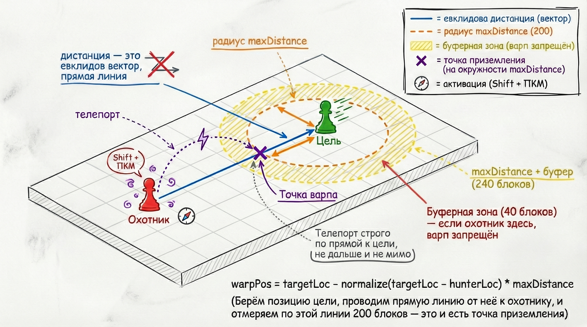
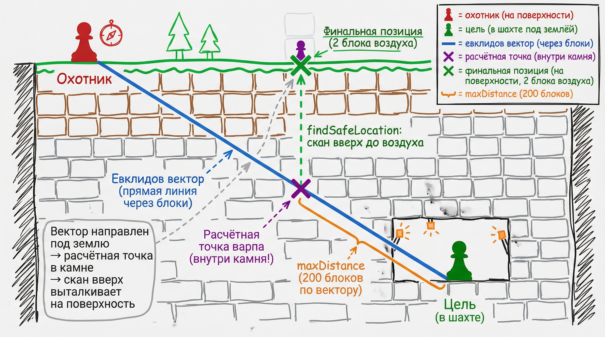

# H-Manhunt

> Плагин Manhunt для актуальных версий Minecraft, сделанный с упором на удобную и динамичную игру.

[![Paper](https://img.shields.io/badge/Paper-1.21%2B-blue?logo=data:image/svg%2Bxml;base64,PHN2ZyByb2xlPSJpbWciIHZpZXdCb3g9IjAgMCAyNCAyNCIgeG1sbnM9Imh0dHA6Ly93d3cudzMub3JnLzIwMDAvc3ZnIj48cGF0aCBmaWxsPSJ3aGl0ZSIgZD0iTTExLjk0NCAwQTEyIDEyIDAgMCAwIDAgMTJhMTIgMTIgMCAwIDAgMTIgMTIgMTIgMTIgMCAwIDAgMTItMTJBMTIgMTIgMCAwIDAgMTIgMGExMiAxMiAwIDAgMC0uMDU2IDB6bTQuOTYyIDcuMjI0Yy4xLS4wMDIuMzIxLjAyMy40NjUuMTRhLjUwNi41MDYgMCAwIDEgLjE3MS4zMjVjLjAxNi4wOTMuMDM2LjMwNi4wMi40NzItLjE4IDEuODk4LS45NjIgNi41MDItMS4zNiA4LjYyNy0uMTY4LjktLjQ5OSAxLjIwMS0uODIgMS4yMy0uNjk2LjA2NS0xLjIyNS0uNDYtMS45LS45MDItMS4wNTYtLjY5My0xLjY1My0xLjEyNC0yLjY3OC0xLjgtMS4xODUtLjc4LS40MTctMS4yMS4yNTgtMS45MS4xNzctLjE4NCAzLjI0Ny0yLjk3NyAzLjMwNy0zLjIzLjAwNy0uMDMyLjAxNC0uMTUtLjA1Ni0uMjEycy0uMTc0LS4wNDEtLjI0OS0uMDI0Yy0uMTA2LjAyNC0xLjc5MyAxLjE0LTUuMDYxIDMuMzQ1LS40OC4zMy0uOTEzLjQ5LTEuMzAyLjQ4LS40MjgtLjAwOC0xLjI1Mi0uMjQxLTEuODY1LS40NC0uNzUyLS4yNDUtMS4zNDktLjM3NC0xLjI5Ny0uNzg5LjAyNy0uMjE2LjMyNS0uNDM3Ljg5My0uNjYzIDMuNDk4LTEuNTI0IDUuODMtMi41MjkgNi45OTgtMy4wMTQgMy4zMzItMS4zODYgNC4wMjUtMS42MjcgNC40NzYtMS42MzV6Ii8+PC9zdmc+)](https://papermc.io/)
[![Java](https://img.shields.io/badge/Java-21-orange?logo=data:image/svg%2Bxml;base64,PHN2ZyByb2xlPSJpbWciIHZpZXdCb3g9IjAgMCAyNCAyNCIgeG1sbnM9Imh0dHA6Ly93d3cudzMub3JnLzIwMDAvc3ZnIj48cGF0aCBmaWxsPSJ3aGl0ZSIgZD0iTTguODUxIDE4LjU2cy0uOTE3LjUzNC42NTMuNzE0YzEuOTAyLjIxOCAyLjg3NC4xODcgNC45NjktLjIxMSAwIDAgLjU1Mi4zNDYgMS4zMjEuNjQ2LTQuNjk5IDIuMDEzLTEwLjYzMy0uMTE4LTYuOTQzLTEuMTQ5TTguMjc2IDE1LjkzM3MtMS4wMjguNzYxLjU0Mi45MjRjMi4wMzIuMjA5IDMuNjM2LjIyNyA2LjQxMy0uMzA4IDAgMCAuMzg0LjM4OS45ODcuNjAyLTUuNjc5IDEuNjYxLTEyLjAwNy4xMy03Ljk0Mi0xLjIxOE0xMy4xMTYgMTEuNDc1YzEuMTU4IDEuMzMzLS4zMDQgMi41MzMtLjMwNCAyLjUzM3MyLjkzOS0xLjUxOCAxLjU4OS0zLjQxOGMtMS4yNjEtMS43NzItMi4yMjgtMi42NTIgMy4wMDctNS42ODggMCAwLTguMjE2IDIuMDUxLTQuMjkyIDYuNTczTTE5LjMzIDIwLjUwNHMuNjc5LjU1OS0uNzQ3Ljk5MWMtMi43MTIuODIyLTExLjI4OCAxLjA2OS0xMy42NjkuMDMzLS44NTYtLjM3My43NS0uODkgMS4yNTQtLjk5OC41MjctLjExNC44MjgtLjA5My44MjgtLjA5My0uOTUzLS42NzEtNi4xNTYgMS4zMTctMi42NDMgMS44ODcgOS41OCAxLjU1MyAxNy40NjItLjcgMTQuOTc3LTEuODJNOS4yOTIgMTMuMjFzLTQuMzYyIDEuMDM2LTEuNTQ0IDEuNDEyYzEuMTg5LjE1OSAzLjU2MS4xMjMgNS43Ny0uMDYyIDEuODA2LS4xNTIgMy42MTgtLjQ3NyAzLjYxOC0uNDc3cy0uNjM3LjI3Mi0xLjA5OC41ODdjLTQuNDI5IDEuMTY1LTEyLjk4Ni42MjMtMTAuNTIyLS41NjggMi4wODItMS4wMDYgMy43NzYtLjg5MiAzLjc3Ni0uODkyTTE3LjExNiAxNy41ODRjNC41MDMtMi4zNCAyLjQyMS00LjU4OS45NjgtNC4yODUtLjM1NS4wNzQtLjUxNS4xMzgtLjUxNS4xMzhzLjEzMi0uMjA3LjM4NS0uMjk3YzIuODc1LTEuMDExIDUuMDg2IDIuOTgxLS45MjggNC41NjIgMCAwIC4wNy0uMDYyLjA5LS4xMThNMTQuNDAxIDBzMi40OTQgMi40OTQtMi4zNjUgNi4zM2MtMy44OTYgMy4wNzctLjg4OSA0LjgzMiAwIDYuODM2LTIuMjc0LTIuMDUzLTMuOTQzLTMuODU4LTIuODI0LTUuNTM5IDEuNjQ0LTIuNDY5IDYuMTk3LTMuNjY1IDUuMTg5LTcuNjI3TTkuNzM0IDIzLjkyNGM0LjMyMi4yNzcgMTAuOTU5LS4xNTMgMTEuMTE2LTIuMTk4IDAgMC0uMzAyLjc3NS0zLjU3MiAxLjM5MS0zLjY4OC42OTQtOC4yMzkuNjEzLTEwLjkzNy4xNjggMCAwIC41NTMuNDU3IDMuMzkzLjYzOSIvPjwvc3ZnPg==)](https://openjdk.org/)

---

## Что такое Manhunt?

> [!TIP]
> **Manhunt** (Охота на игрока) - популярный режим в Minecraft, который многие знают по серии роликов **Dream** *"Minecraft Speedrunner VS Hunter"*.
>
> **Суть режима:**
> *   **Спидраннер:** Один или несколько игроков должны как можно быстрее убить Дракона Края. Их задача - выжить и довести прохождение до конца.
> *   **Охотники:** Группа игроков должна остановить спидраннера и убить его раньше, чем падет Дракон. У охотников бесконечные жизни и **Компас**, который всегда указывает на местоположение спидраннера.

> [!NOTE]
> **H-Manhunt** - это плагин, с которым можно запустить Manhunt на серверах Paper (1.21+) и играть в него с друзьями. Здесь есть не только классическая охота, но и дополнительные механики, которые делают игру разнообразнее.

---

## Совместимость

| | Статус |
|---|---|
| Серверное ядро | **Paper 1.21+** |
| Проверено на | **Paper 1.21.11 (build 99)** |
| Java | **21** |

| Ядро | Поддержка |
|---|---|
| **Paper** | Основная платформа |
| **Форки Paper** (Purpur, Pufferfish) | Обычно совместимы, без гарантии |
| **Spigot / Bukkit** | Не поддерживаются |

---

## Основные возможности

*   **Быстрое управление:** Роли охотников и спидраннеров удобно настраиваются через команды `/manhunt`.
*   **Продвинутый трекинг:** Компас умеет отслеживать либо ближайшую цель, либо конкретного выбранного игрока.
*   **Межпространственная охота:** При включённом `trackPortals` компас не теряет цель после перехода в Незер или Энд и показывает последний портал.
*   **Система пауз:** Матч можно поставить на паузу через голосование, если возникли технические проблемы или просто нужен перерыв.
*   **Способности (Casual Mode):** Для охотников доступны особые навыки, например **Warp Shadows** - быстрый варп в сторону цели, который помогает не терять темп погони.

---

## Команды

| Команда | Описание |
|---|---|
| `/manhunt add <role> <player> ...` | Добавить игроков в роль |
| `/manhunt add <role> @a` | Добавить всех онлайн-игроков |
| `/manhunt remove <player> ...` | Удалить игроков из матча |
| `/manhunt remove @a` | Удалить всех из матча |
| `/manhunt start` | Запустить матч |
| `/manhunt reset` | Сбросить матч |
| `/manhunt pause` | Поставить на паузу |
| `/manhunt unpause` | Снять паузу |
| `/manhunt list` | Список участников и ролей |
| `/manhunt rules <rule> [value]` | Посмотреть/изменить правило |
| `/manhunt help` | Справка |

---

## Конфигурация (`config.yml`)

| Ключ | Тип | По умолчанию | Описание |
|---|---|---|---|
| `timeSetDayOnStart` | boolean | `true` | Установить день при старте матча |
| `weatherClearOnStart` | boolean | `true` | Очистить погоду при старте матча |
| `headStartDuration` | int | `0` | Фора спидраннерам (секунды) |
| `speedrunnersLives` | int | `1` | Количество жизней спидраннеров |
| `spectatorAfterDeath` | boolean | `true` | Переводить погибших в spectator |
| `teleport` | boolean | `true` | Телепорт участников в одну точку перед стартом |
| `trackPortals` | boolean | `true` | Отслеживать цель между измерениями |
| `friendlyFire` | boolean | `true` | Урон по союзникам |
| `compassMenu` | boolean | `false` | Выбор цели через GUI-меню |
| `trackNearestMode` | boolean | `true` | Режим трекинга ближайшего спидраннера |
| `clearInventories` | boolean | `true` | Очищать инвентари при старте |
| `takeAwayOps` | boolean | `true` | Временно снимать OP во время матча |
| `usePermissions` | boolean | `false` | Проверять права на команды |
| `useBossBarRadar` | boolean | `false` | BossBar-радар союзников |
| `enablePauses` | boolean | `true` | Разрешить паузу/возобновление |
| `matchWorlds.enabled` | boolean | `false` | Включить автоматическое создание отдельного матч-мира |
| `matchWorlds.autoGenerate.worldPrefix` | string | `manhunt_match_` | Префикс имени для новых миров |
| `matchWorlds.autoGenerate.keepLatestWorlds` | int | `2` | Сколько последних автосозданных миров хранить |
| `matchWorlds.autoGenerate.maxAttempts` | int | `4` | Сколько сидов пробовать при подборе мира |
| `matchWorlds.autoGenerate.minScoreToAccept` | int | `90` | Порог качества мира для мгновенного принятия |
| `matchWorlds.autoGenerate.acceptBestCandidateIfThresholdMissed` | boolean | `true` | Брать лучший мир, если идеальный не найден |
| `matchWorlds.autoGenerate.fixedSeeds` | list | `[]` | Список ручных сидов вместо случайных |
| `matchWorlds.autoGenerate.startDistanceFromAnchor` | int | `140` | На каком расстоянии от ключевой структуры ставить старт |
| `casual` | boolean | `true` | Способности охотников (Shift + ПКМ по компасу) |
| `warpShadowsCooldown` | int | `300` | Кулдаун Warp Shadows (секунды) |
| `warpShadowsMaxDistance` | int | `200` | Дистанция до цели после варпа |
| `warpShadowsBufferZone` | int | `40` | Порог, ближе которого варп не срабатывает |

### Автоматическая генерация матч-мира

`H-Manhunt` можно перевести в режим полной автоматизации старта матча. В этом случае `/manhunt start` не берёт текущий мир сервера, а сам:

*   создаёт новый overworld через Paper `WorldCreator`;
*   перебирает несколько сидов;
*   оценивает каждый мир по эвристике вокруг спавна;
*   выбирает лучший вариант и переносит туда игроков;
*   ставит старт не прямо в структуре, а на расстоянии от неё.

При оценке мира учитывается то, что обычно делает ранний Manhunt бодрее и удобнее на старте:

*   хороший стартовый биом;
*   близкая деревня;
*   разрушенный портал;
*   корабль;
*   наличие дерева;
*   выразительный рельеф.

Это уже скорее подбор мира под быстрый забег, а не обычная работа multiworld-плагина: мир не создаётся наугад, а выбирается под нужный темп игры.

Важно: всё это работает на собственной логике `H-Manhunt`, без зависимости от сторонних multiworld-плагинов.

Дополнительно:

*   стартовая точка выбирается относительно лучшей найденной структуры;
*   спидраннер получает короткую подсказку по направлению к ближайшей полезной структуре.

### Как работает Warp Shadows?

**Warp Shadows (Варп тени)** - это способность охотника, которая позволяет телепортироваться в сторону спидраннера. Она нужна, чтобы сократить дистанцию, когда цель ушла слишком далеко и погоня начинает замедляться.

Охотник не появляется прямо рядом с целью: он приземляется на расстоянии `warpShadowsMaxDistance` блоков и дальше продолжает преследование сам. Если охотник уже достаточно близко, то есть ближе чем `maxDistance + bufferZone`, варп не сработает - способность не даёт нечестного преимущества в ближнем бою.

Активация: **Shift + ПКМ** по компасу охотника → меню способностей → Варп тени.

Если спидраннер ушёл в другое измерение, то есть в Незер или Энд, и включён `trackPortals: true`, варп работает по тому же принципу: способность берёт последние сохранённые координаты цели в мире охотника и телепортирует к точке последнего портала. Благодаря этому охотник не теряет след даже при переходах между измерениями.

> *Схема работы Warp Shadows*

Если спидраннер ушёл в шахту, а охотник остаётся на поверхности, вектор телепорта пойдёт по диагонали вниз, прямо через камень. Расчётная точка варпа окажется внутри породы, но алгоритм `findSafeLocation` автоматически просканирует пространство вверх и переместит охотника в ближайшую безопасную точку с двумя блоками воздуха - на поверхность или прямо в шахту, если там есть свободное место.

> *Варп когда спидраннер в шахте: вектор уходит под землю, охотник приземляется на поверхности*

---

## Права доступа

> Работают только при `usePermissions: true`

| Permission | Описание |
|---|---|
| `manhunt.manhunt` | Доступ ко всем командам |
| `manhunt.add` | Добавление игроков |
| `manhunt.remove` | Удаление игроков |
| `manhunt.start` | Запуск матча |
| `manhunt.reset` | Сброс матча |
| `manhunt.pause` | Пауза без голосования |
| `manhunt.unpause` | Снятие паузы без голосования |
| `manhunt.list` | Просмотр состава |
| `manhunt.rules` | Просмотр/изменение правил |
| `manhunt.help` | Справка |

---

## Credits

Оригинальный проект: [Matistan / MinecraftManhunt](https://github.com/Matistan/MinecraftManhunt)
